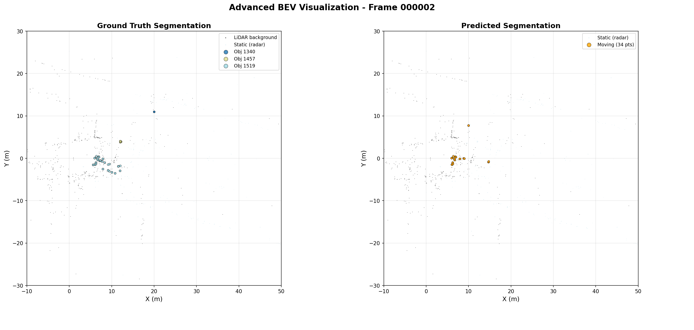
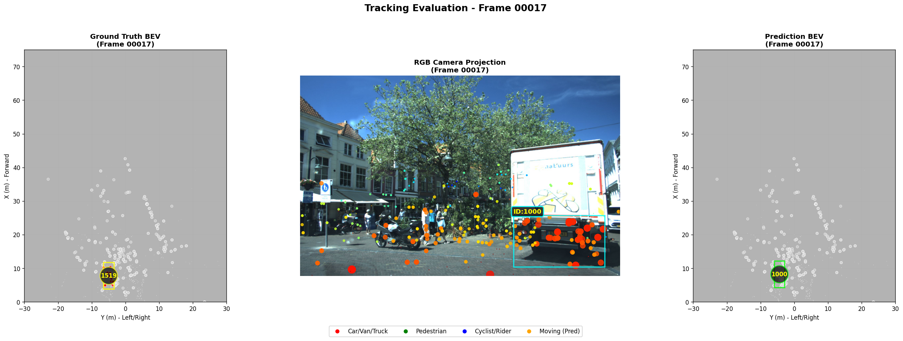

# Multimodal Tracking with Local-Global Feature Fusion


A multimodal tracking approach combining local and global features for 3D object tracking and segmentation using point clouds and images.

## Table of Contents

- [Prerequisites](#prerequisites)
- [Dataset](#dataset)
- [Environment Setup](#environment-setup)
- [Training](#training)
  - [Phase 1: Backbone Pre-training](#phase-1-backbone-pre-training)
  - [Phase 2: Tracking Model](#phase-2-tracking-model)
- [Evaluation](#evaluation)
- [Results](#results)
- [References](#references)

## Prerequisites

This project requires access to the View of Delft dataset and corresponding tracking annotations.

## Dataset

### Required Data

1. **View of Delft Dataset**
   - Link: [tudelft-iv/view-of-delft-dataset](https://github.com/tudelft-iv/view-of-delft-dataset/tree/main)
   - Requires authorization from the authors

2. **Tracking Annotations**
   - Link: [RaTrack Annotations](https://github.com/LJacksonPan/RaTrack/tree/main)

3. **2D Projected Annotations**
   - Available on Zenodo

### Expected Dataset Structure

```
dataset/
├── ...
├── ...
└── ...
```

## Environment Setup

Build and run the Docker environment:

```bash
docker compose build
docker compose run
```

### GPU Considerations

When using PointNet with GPU acceleration, the library needs to be loaded and compiled for the specific GPU. This environment has been tested on:
- Personal machine with **RTX 3060**
- Cluster with dual **A100-PCIE-40GB**

**Note:** In multi-GPU scenarios, the environment does not properly utilize hybrid usage.

## Training

### Phase 1: Backbone Pre-training

Pre-train the backbone using the segmentation configuration:

```bash
python train.py --config config/segmentation_phase1.yml
```

This will:
- Create logs in TXT format
- Save the best model checkpoint based on mIoU or F1-score at point level
- Optionally, use pre-trained weights (link provided in repository)

#### Evaluation and Visualization

To evaluate the trained model on the test set:
1. Point to the pre-trained weights in `config/segmentation_phase1.yml`
2. Enable `plot_segmentation` to generate inference visualizations

**Expected output:**



### Phase 2: Tracking Model

Train the tracking model with gallery-based re-identification:

```bash
python train.py --config config/reid_phase2.yml
```

Enable `plot_reid` to visualize results similar to the following:



*Left: Ground truth track IDs | Right: Predicted track IDs (vehicle class example)*

**Note:** This phase trains with perfect boxes and segmentation. During inference, the pre-trained model from Phase 1 is used.

## Evaluation

Run inference with the pre-trained segmentation model:

```bash
python eval.py --config config/eval_config.yaml
```

Pre-trained weights for both phases are available. Simply point to them in the configuration and run the evaluation script.

## Results

Performance comparison on the View of Delft dataset:

| Method | sAMOTA ↑ | AMOTA ↑ | MOTA ↑ | IDSW ↓ | mIoU ↑ |
|--------|----------|---------|--------|--------|--------|
| AB3DMOT-PP | 60.71 | 21.51 | 49.38 | -- | -- |
| RaTrack | 74.16 | 31.50 | 67.27 | -- | 57.0 |
| **LocalGlobalFusion (Ours)** | **76.5** | **34.0** | **69.5** | **84** | **63.0** |
| voxelPointFusion | 70.5 | 30.5 | 64.5 | 150 | 53.3 |

## References

This repository contains basic elements for evaluating metrics and loading data, adapted from:

- [AB3DMOT](https://github.com/xinshuoweng/AB3DMOT)
- [RaTrack](https://github.com/LJacksonPan/RaTrack)
- [View of Delft Dataset](https://github.com/tudelft-iv/view-of-delft-dataset)


